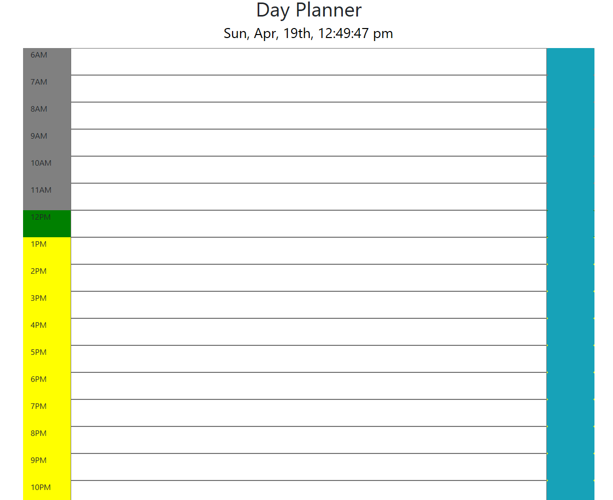

The daily planner application uses moment.js to keep the current time as well as color code the following hour blocks based off of the current time. Hours before the current time appear grey, those after yellow, and the current hour appears green. The layout was created with a simple bootstrap column/row system where each row is under a parent div. 
    Previous iterations of the program had to be changed because the row elements were not under the same parent element and jquery's documentation wasn't fast enough to save the text areas input to local storage when the button was clicked. Having a parent and sibling layout made the logic run more quickly. You can see the previous logic in prior iterations on this Github.    Github is refusing to show my .png image, cannot locate the cause.
 
 
 
  
 ` 
   
   

  
